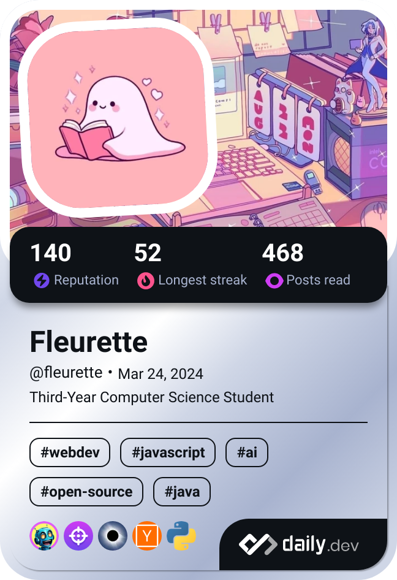

# 💫 About Me:
🔭 I'm currently working on some of my repositories. 🌱 I'm currently learning the things that my heart wants. 💬 Ask me anything, and expect a wrong answer. ⚡ Fun fact: I use Arch, btw.

### 🪪 DevCard

# 🌐 Socials:
    

# 💻 Tech Stack:
                                                
# 📊 GitHub Stats:
 
 

## 🏆 GitHub Trophies

### ✍️ Random Dev Quote

### 🔝 Top Contributed Repo

---

<!-- Proudly created with GPRM ( https://gprm.itsvg.in ) -->
